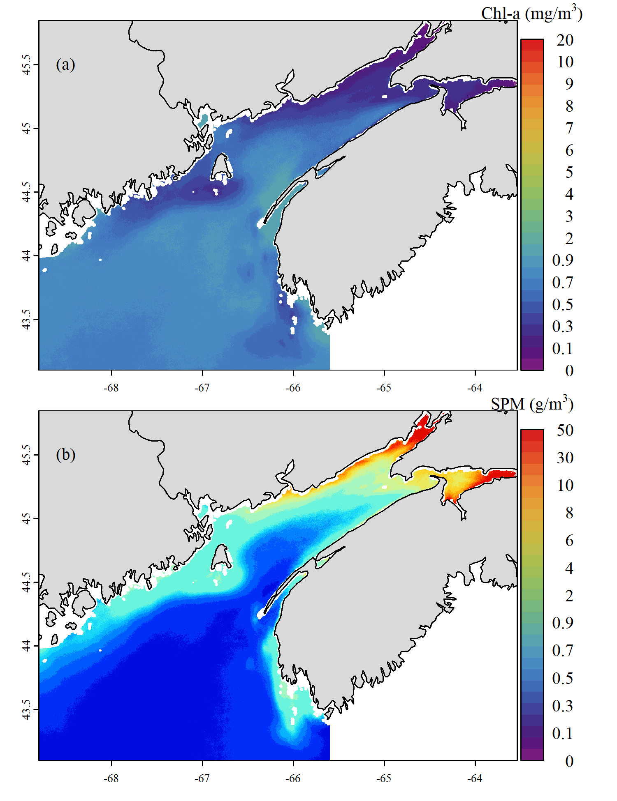

## Improving satellite chlorophyll-a retrieval in the turbid waters of the Bay of Fundy, Canada

Wilson KL, Hilborn A, Clay S, Devred E (2023) Improving satellite chlorophyll-a retrieval in the turbid waters of the Bay of Fundy, Canada (In prep) Estuaries and Coasts

This project focused on improving chl-a and SPM retrieval in the Bay of Fundy.

The yearly and seasonal climatology layers are hosted on Open Data at:

Please contact for daily composites: 

### Running the data, analysis and figures:

All downloading, processing, analysis and plotting code is included in the `./Scripts` folder. To run all steps, you will need to install R, Python, [SeaDAS](https://seadas.gsfc.nasa.gov/) with [OCSSW processing](https://seadas.gsfc.nasa.gov/requirements/), and [GMT](https://www.generic-mapping-tools.org/).

* The following R packages are required: `ncdf4` `httr` `jsonlite` `stringr` `dplyr` `terra` `sf` `lmodel2` `Metrics` [`oceancolouR`](https://github.com/BIO-RSG/oceancolouR) `data.table` `raster` `doParallel` `foreach` `lubridate` `sp`
  * To recreate all plots, the following are also needed: `ggplot2` `cowplot` `gridGraphics` `ggplotify` `patchwork` `pals` `rnaturalearth` `ggspatial` `scales` `plotrix` `hexbin`
* The following Python packages are required: `numpy` `netCDF4`

#### MODIS-Aqua Image Processing Steps:

MODIS-Aqua [L1A images](https://oceancolor.gsfc.nasa.gov/resources/docs/product-levels/) are downloaded from the NASA [Ocean Biology Processing Group](https://oceancolor.gsfc.nasa.gov/) and processed with [SeaDAS](https://seadas.gsfc.nasa.gov/) `l2gen`. Using this level and program the atmospheric correction and resolution details can be customized. Once the images are atmospherically corrected, further products are calculated from the Remote-sensing reflectance (*Rrs*), regridded onto a common grid, and merged into daily composites. All further analysis occurred using the regridded daily composites at 300 m spatial resolution.

**Note** that this data was assembled before the NASA OBPG R2022.0 reprocessing so retain the old naming convention! E.g. `A2018161180500.L1A_LAC`- **A**: MODIS-Aqua, **2018161**: day 161 of 2018, aka June 10th, **180500** is 18:05:00 UTC

* To download images from NASA OBPG, creating an account and setting up a `.netrc` file are required: see the "Download Methods" tab [at their site](https://oceancolor.gsfc.nasa.gov/data/download_methods/)

1. `01_GetFilenames_MODISA.R`: Get L1A filenames
  * Side quest: you can find the processed L2 files with `dataset = "MODISA_L2_OC"` and filter out images with no data, to save time downloading and processing the L1A. See `01b_DownloadL2.sh` for helper functions, but this script is now defunct due to the name convention change.
2. Download L1A files with `02_DownloadL1A.sh`
3. `03_L1A_to_L3.sh`: Processes images in SeaDAS with `00_l2genSwir.sh`. Uses `00_Filter_ComputeProducts.py` to apply masks, do further filtering, and calculate SPM and Chl-a.
   * Includes new chl-a algorithm and other output products written to ASCII.
   * Uses GMT to grid to NetCDF in a given bounding box, and `00_MakeDailyComposites_MODISA.R` to grid to daily composites.

### References for in situ data used in this study:

1. [BIOCHEM](https://www.dfo-mpo.gc.ca/science/data-donnees/biochem/index-eng.html): Devine, L., M. K. Kennedy, I. St-Pierre, C. Lafleur, M. Ouellet, and S. Bond. 2014. BioChem: the Fisheries and Oceans Canada database for biological and chemical data. Can. Tech. Rep. Fish. Aquat. Sci. 3073: iv + 40 p.
2. Western Isles phytoplankton monitoring program: Martin, J. L., M. M. Legresley, and M. E. Gidney. 2014. [Phytoplankton monitoring in the Western Isles region of the Bay of Fundy during 2007-2013.](https://publications.gc.ca/collections/collection_2014/mpo-dfo/Fs97-6-3105-eng.pdf) Can. Tech. Rep. Fish. Aquat. Sci. 3105: v + 262 p.
3. Zions, V. S., B. A. Law, C. O. Laughlin, K. J. Morrison, A. Drozdowski, G. L. Bugden, and S. Roach. 2017. [Spatial and temporal characteristics of water column and seabed sediment samples from Minas Basin, Bay of Fundy.](https://publications.gc.ca/collections/collection_2018/mpo-dfo/Fs97-6-3233-eng.pdf) Can. Tech. Rep. Fish. Aquat. Sci. 3233: vi + 95.
4. Horne, E., and B. Law. 2013. [Cruise report Hudson 2013013 Minas Basin June 4 - 16, 2013.](https://fern.acadiau.ca/tl_files/sites/fern/Files%202013/Hudson%202013-013%20Crusie%20Report_BayofFundy_Final.pdf)

### Coastline and boundary files:

* Canada: 
* U.S.A.: [United States Census Bureau Cartographic Boundary Files](https://www.census.gov/geographies/mapping-files/time-series/geo/cartographic-boundary.html)
